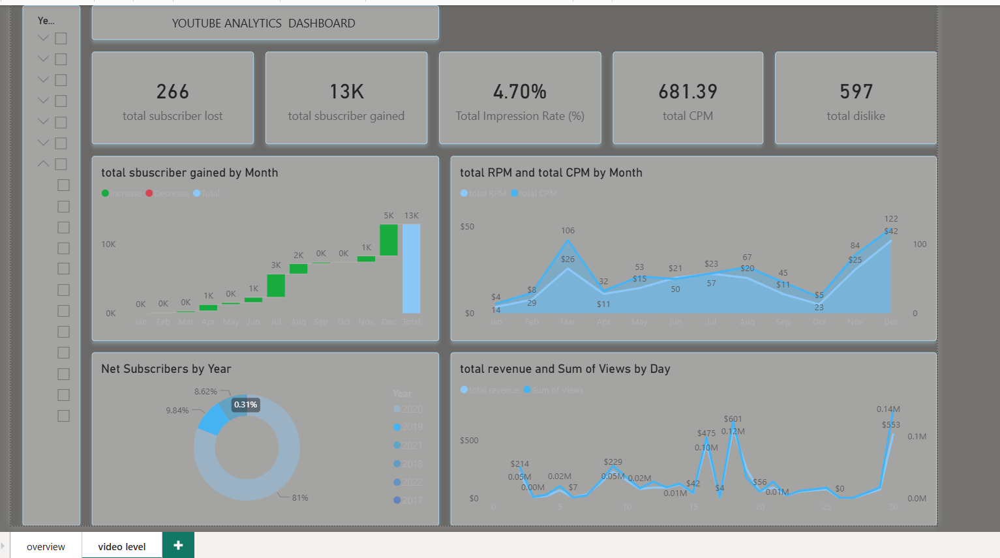

# 📊 YouTube Analysis Dashboard

    

## 🔹 Project Overview

This project is an interactive Power BI dashboard used to analyze YouTube video performance, audience engagement, and channel growth.

## 🔹 Objectives

* Analyze views, likes, and comments
* Identify top-performing videos
* Track channel growth over time
* Understand audience engagement

## 🔹 Tools Used

* Microsoft Power BI
* Power Query
* DAX

## 🔹 Key Features

* Interactive dashboard
* Engagement analysis (views, likes, comments)
* Top videos identification
* Growth trend analysis

## 🔹 Insights

* Some videos perform better than others
* Engagement changes over time
* Trends help identify popular content

## 🔹 Project Files

* YouTube_Analysis.pbix
* youtube-dashboard.png

## 🔹 How to Use

* Download the .pbix file
* Open in Power BI Desktop
* Explore the dashboard

---

✨ This project showcases Power BI dashboarding and data analysis skills.
