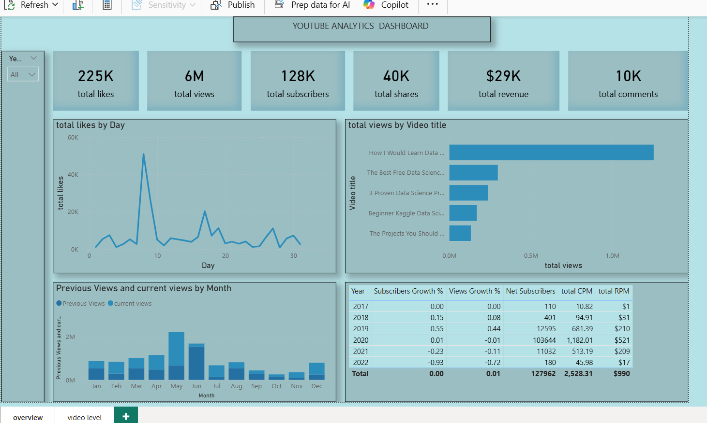

# 📊 YouTube Analysis Dashboard

## 📌 Project Overview
This project is an interactive Power BI dashboard used to analyze YouTube video performance, audience engagement, and channel growth.

## 🛠 Tools Used
- Microsoft Power BI
- Power Query
- DAX

## 📈 Key Insights
- Some videos perform better than others  
- Engagement (likes, comments) varies across videos  
- Channel growth changes over time  
- Certain content types attract more audience  

## 🎯 Business Recommendations
- Focus on high-performing content types  
- Improve engagement using better titles and thumbnails  
- Maintain consistency in posting  
- Analyze audience behavior for better targeting  

## 📷 Dashboard Preview

  
  

## 📂 Project Files
- YouTube_Analysis.pbix  
- YT_dashboard.png  
- YT_dashboard_2.png  

## 👩‍💻 Author
**Pragya Malviya**  
Aspiring Data Analyst  

---
✨ This project demonstrates Power BI dashboarding, data visualization, and data-driven decision-making skills.
